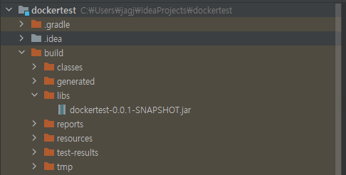
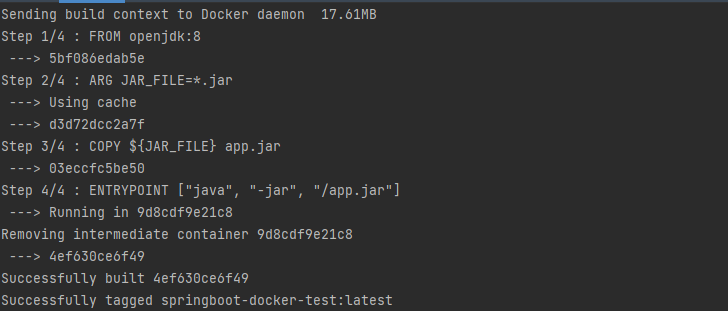
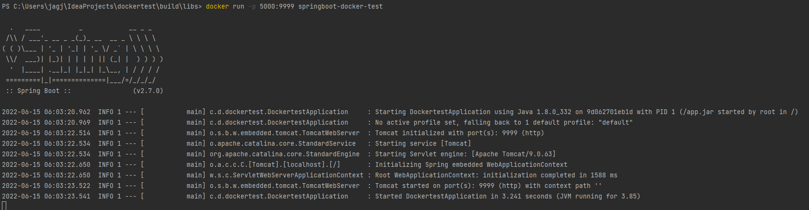
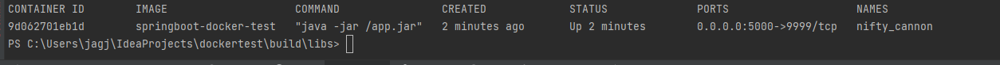
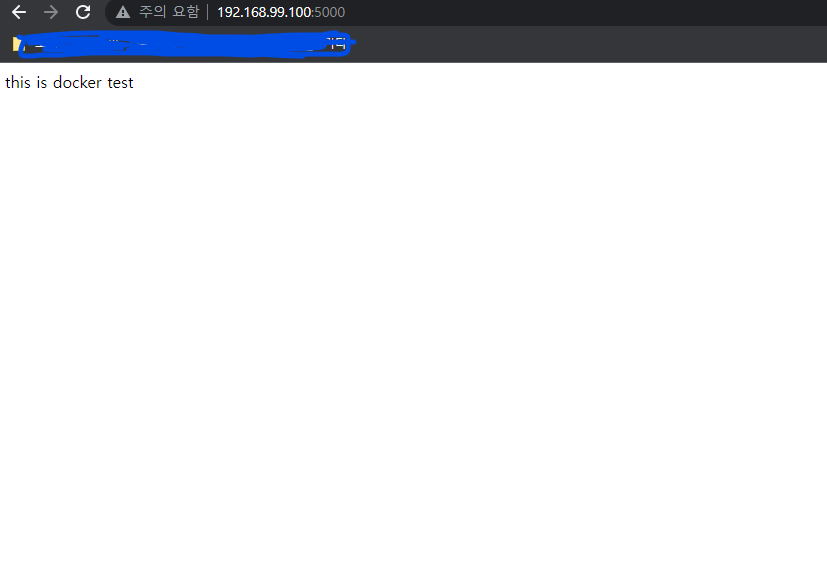

# spring-boot-docker-test
Docker 및 SpringBoot 이용한 이미지 생성, 배포

## 1. SpringBoot 소스 코드 생성

```java
package com.docker.dockertest;

import org.springframework.boot.SpringApplication;
import org.springframework.boot.autoconfigure.SpringBootApplication;
import org.springframework.web.bind.annotation.GetMapping;
import org.springframework.web.bind.annotation.RestController;

@RestController
@SpringBootApplication
public class DockertestApplication {

	@GetMapping("/")
	public String test() {
		return "this is docker test";
	}

	public static void main(String[] args) {
		SpringApplication.run(DockertestApplication.class, args);
	}

}
```

## 2. 이미지를 만들기 전에 작동하는지 확인하기 위해 jar 파일 생성

```powershell
$ ./gradlew build
```
빌드시 프로젝트 루트 > build > libs에 jar 파일이 생성된다.



제대로 작동하는지 jar 파일을 실행시켜본다.
```powershell
$ java -jar dockertest-0.0.1-SNAPSHOT.jar
```

제대로 작동하는것을 확인하면 도커 이미지를 생성한다. 그러기 위해 먼저 Dockerfile을 생성해야한다.

## 3. Dockerfile 생성

.jar 파일이 생성된곳에 Dockerfile을 생성한다.

```docker
FROM openjdk:8
ARG JAR_FILE=*.jar
COPY ${JAR_FILE} app.jar
ENTRYPOINT ["java", "-jar", "/app.jar"]
```
- FROM : Docker Base Image
- ARG : Container 내에서 사용할 수 있는 변수 지정 (JAR_FILE 변수에 *.jar 경로를 담음)
- COPY : JAR_FILE 변수를 컨테이너의 app.jar로 복사한다.
- ENTRYPOINT : Container가 실행할 때 수행되는 명령어를 지정

## 4. Dockerfile을 이용해 이미지를 빌드
cd 명령어를 통해 jar 파일이 있는 곳으로 터미널 위치를 옮긴후 명령어를 입력해 이미지를 생성한다.
```powershell
$ docker build -t springboot-docker-test .
```

. 붙여줘야함!! (해당 경로에 Docker 파일 있음을 명시)



위와 같이 나왔다면 성공!

## 5. 빌드된 이미지를 확인한다.

해당 명령어를 실행시켜 이미지가 제대로 생성되었는지 확인한다.

```powershell
$ docker images
```

```powershell
REPOSITORY               TAG                 IMAGE ID            CREATED             SIZE
springboot-docker-test   latest              4ef630ce6f49        59 seconds ago      544MB
openjdk                  8                   5bf086edab5e        2 weeks ago         526MB
hello-world              latest              feb5d9fea6a5        8 months ago        13.3kB
```

## 6. Container 실행.

```powershell
$ docker run -p 5000:9999 springboot-docker-test
```



docker Container 실행 시에 "-p" 옵션을 추가하여 포트 포워딩을 설정할 수 있다.<br> 
ex) 5000:9999 -> 호스트 시스템의 5000번 TCP Port로 유입되는 트래픽은 모두 docker Container의 9999 포트로 전달된다.

아래 명령어를 실행 후 Container가 제대로 가동하고 있는지 확인한다.
```powershell
$ docker ps
```


Container가 가동하고 있는지 확인 후 브라우저에서 [192.168.99.100:5000](http://192.168.99.100:5000/) 으로 접속하여 제대로 실행되었는지 확인한다.<br>
<ins><b>※</b> docker toolbox인 경우에는 ip주소로 접속해야함. (localhost(x))</ins>



정상적으로 접속됐다면 성공!!


